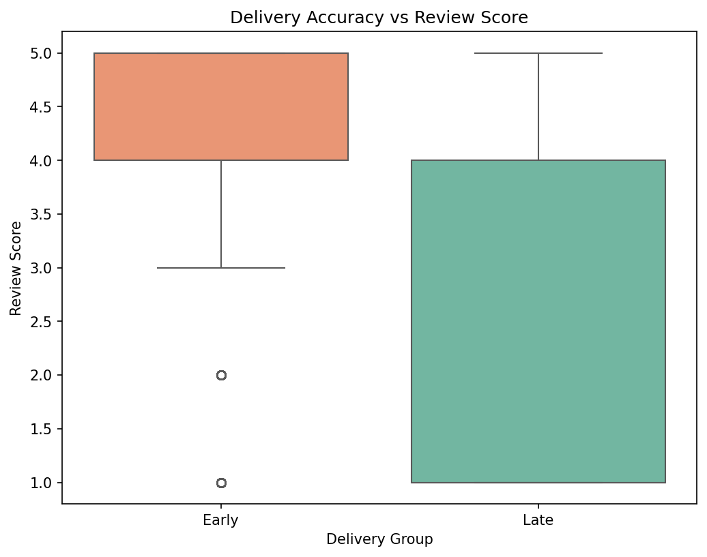
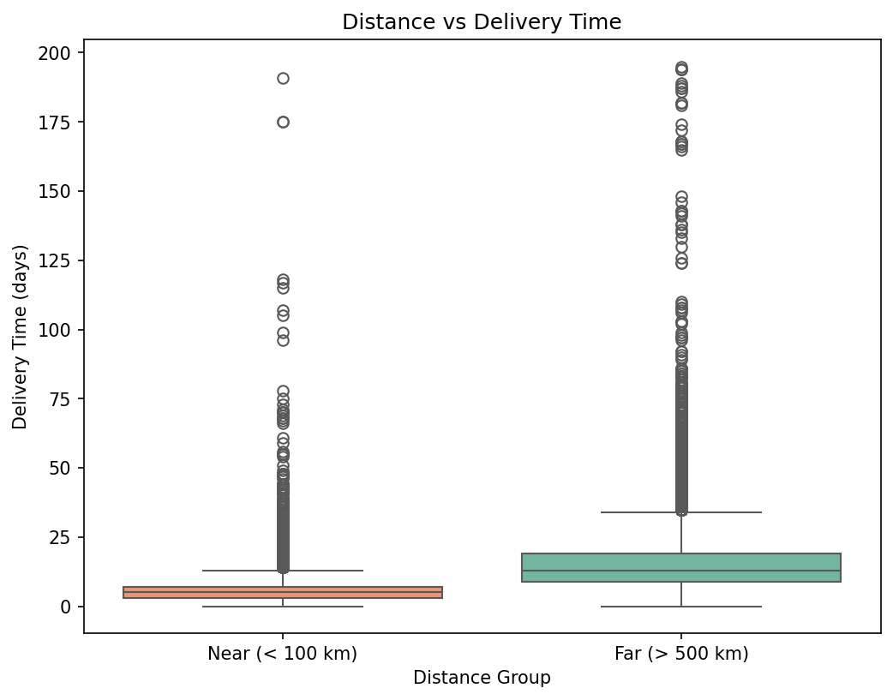
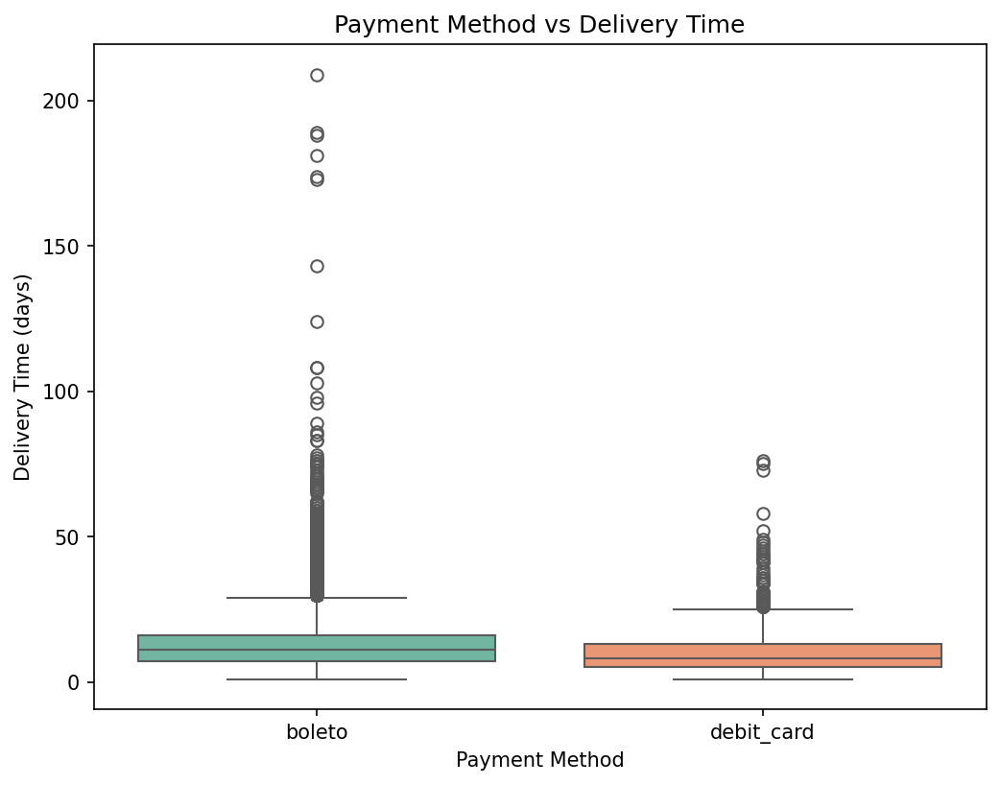
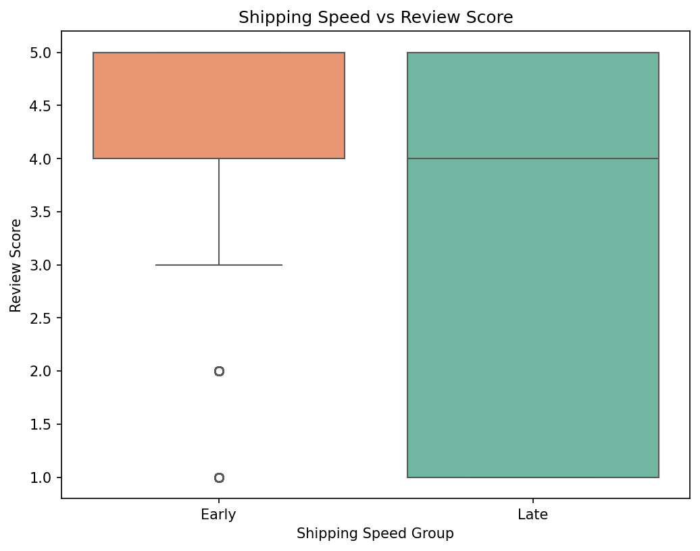

# Olist Brazilian E-Commerce: Hypothesis Testing with BigQuery

A statistical analysis of 100,000+ real e-commerce transactions using BigQuery and Python to quantify the impact of delivery accuracy, shipping speed, distance, and payment method on customer satisfaction and delivery time.

## Tech Stack
- **Data Warehouse:** Google BigQuery (GCP)
- **Languages:** Python, SQL
- **Libraries:** pandas, scipy, statsmodels, numpy
- **Tools:** Google Cloud SDK, VS Code, Git

## Dataset
- **Source:** [Olist Brazilian E-Commerce Dataset](https://www.kaggle.com/datasets/olistbr/brazilian-ecommerce) (Kaggle)
- **Size:** 100,000+ orders across 9 tables
- **Period:** 2016–2018
- **Loaded into:** Google BigQuery (`olist` dataset, GCP project `project-ccbf6acf-9991-4d10-82d`)

### Tables
- `olist_orders_dataset`
- `olist_order_items_dataset`
- `olist_order_reviews_dataset`
- `olist_order_payments_dataset`
- `olist_customers_dataset`
- `olist_sellers_dataset`
- `olist_products_dataset`
- `olist_geolocation_dataset`
- `olist_order_payments_dataset`

## Project Structure
```
olist-ab-testing/
├── data/                  # Raw CSV files
├── sql/                   # BigQuery exploration queries
├── analysis/              # Python hypothesis testing scripts
│   ├── exp1_delivery_accuracy_vs_review.py
│   ├── exp2_distance_vs_delivery_time.py
│   ├── exp3_payment_method_vs_delivery_time.py
│   └── exp4_shipping_speed_vs_review.py
├── results/               # Output plots and summaries
├── notebooks/             # Exploratory notebooks
├── upload_to_bigquery.py  # Script to load CSVs into BigQuery
└── README.md
```

## Experiments

### Experiment 1: Delivery Accuracy vs Review Score
**Business Question:** Do late deliveries significantly impact customer satisfaction?

**Methodology:**
- Grouped orders into Early, Late, and On-time based on estimated vs actual delivery date
- Compared review scores between Early (n=87,196) and Late (n=6,409) groups
- Shapiro-Wilk confirmed non-normal distribution → used Mann-Whitney U test

**Findings:**
| Metric | Early | Late |
|--------|-------|------|
| Mean Review Score | 4.30 | 2.27 |
| Std Dev | 1.15 | 1.57 |



- Mann-Whitney p-value: 0.0000
- Cohen's d: 1.47 (very large effect)
- 95% CI: (1.99, 2.06)
- Power: 1.0

**Recommendation:** Late deliveries cause a ~2 point drop in review score. Improving delivery accuracy is the single highest-leverage action to improve customer satisfaction.

### Experiment 2: Customer-Seller Distance vs Delivery Time
**Business Question:** Do orders from faraway sellers take significantly longer to deliver?

**Methodology:**
- Calculated geographic distance between customer and seller using BigQuery's ST_DISTANCE and geolocation data
- Grouped orders into Near (< 100 km, n=20,481) and Far (> 500 km, n=46,748)
- Shapiro-Wilk confirmed non-normal distribution → used Mann-Whitney U test

**Findings:**
| Metric | Near | Far |
|--------|------|-----|
| Mean Delivery Time | 6.1 days | 15.5 days |
| Std Dev | 6.0 days | 10.3 days |



- Mann-Whitney p-value: 0.0000
- Cohen's d: 1.13 (large effect)
- 95% CI: (-9.60, -9.35)
- Power: 1.0

**Recommendation:** Far deliveries take ~9.5 days longer than near ones. Olist should prioritize expanding its seller network in underserved regions to reduce distance-driven delivery delays.

### Experiment 3: Payment Method vs Delivery Time
**Business Question:** Does payment method affect how long an order takes to deliver?

**Methodology:**
- Compared delivery times between Boleto (n=19,191) and Debit Card (n=1,486) orders
- Shapiro-Wilk confirmed non-normal distribution → used Mann-Whitney U test

**Findings:**
| Metric | Boleto | Debit Card |
|--------|--------|------------|
| Mean Delivery Time | 13.04 days | 10.32 days |
| Std Dev | 9.2 days | 7.8 days |



- Mann-Whitney p-value: 0.0000
- Cohen's d: 0.31 (small effect)
- 95% CI: (2.28, 3.15)
- Power: 1.0

**Recommendation:** Boleto takes ~2.7 days longer than debit card. Effect is statistically significant but small — payment method is a minor factor in delivery time and not a priority lever.

### Experiment 4: Seller Shipping Speed vs Review Score
**Business Question:** Does a seller shipping late affect customer review scores?

**Methodology:**
- Classified sellers as Early or Late based on whether they shipped before or after the shipping limit date
- Compared review scores between Early (n=104,898) and Late (n=5,115) groups
- Shapiro-Wilk confirmed non-normal distribution → used Mann-Whitney U test

**Findings:**
| Metric | Early | Late |
|--------|-------|------|
| Mean Review Score | 4.11 | 3.39 |
| Std Dev | 1.23 | 1.58 |



- Mann-Whitney p-value: 0.0000
- Cohen's d: 0.49 (medium effect)
- 95% CI: (0.68, 0.77)
- Power: 1.0

**Recommendation:** Late shipments lead to ~0.72 lower review scores. Effect is statistically significant and medium — shipping speed is an important factor in customer satisfaction and should be a priority lever for sellers.

## Key Takeaways

| Experiment | Cohen's d | Effect Size | Recommendation |
|------------|-----------|-------------|----------------|
| Delivery accuracy vs review score | 1.47 | Very Large | Highest priority — late deliveries devastate satisfaction |
| Customer-seller distance vs delivery time | 1.13 | Large | Expand seller network in underserved regions |
| Seller shipping speed vs review score | 0.49 | Medium | Incentivize sellers to ship on time |
| Payment method vs delivery time | 0.31 | Small | Low priority — minor impact on delivery time |

**Overall:** Delivery accuracy and geographic distance are the two biggest levers for improving customer experience on the Olist platform. Payment method has a statistically significant but practically small effect and should be deprioritized.

## How to Run

### Prerequisites
- Python 3.12+
- Google Cloud SDK installed and authenticated
- BigQuery API enabled on GCP

### Setup
```bash
# Clone the repo
git clone https://github.com/viswanathv4320/olist-ab-testing.git
cd olist-ab-testing

# Create and activate virtual environment
python -m venv .venv
source .venv/bin/activate

# Install dependencies
pip install google-cloud-bigquery pandas scipy statsmodels numpy

# Authenticate with GCP
gcloud auth application-default login
```

### Run Experiments
```bash
python analysis/exp1_delivery_accuracy_vs_review.py
python analysis/exp2_distance_vs_delivery_time.py
python analysis/exp3_payment_method_vs_delivery_time.py
python analysis/exp4_shipping_speed_vs_review.py
```